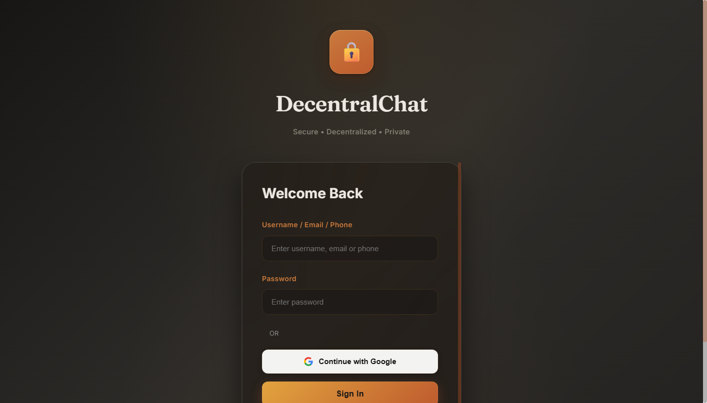
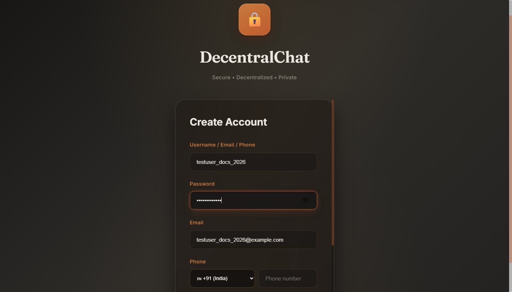
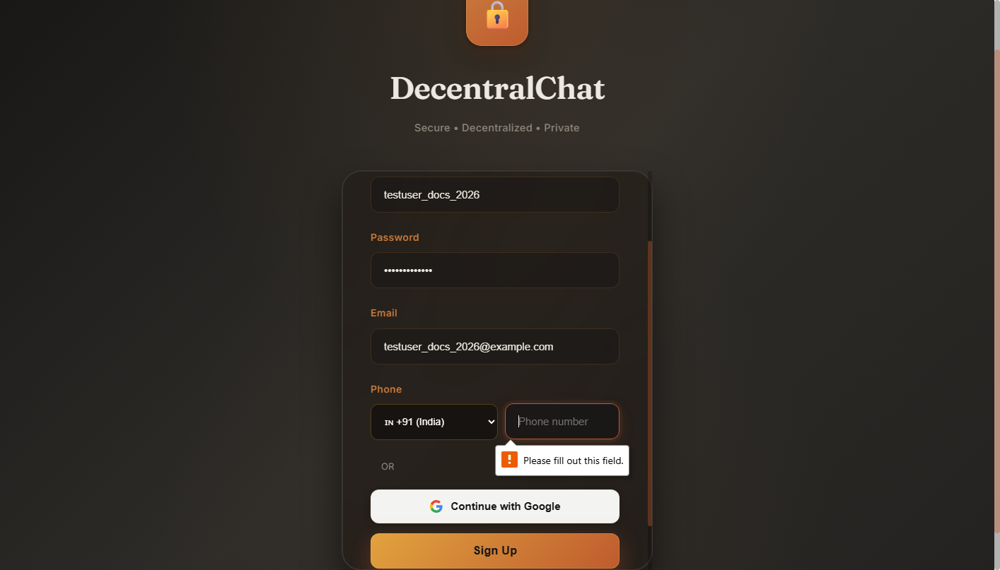
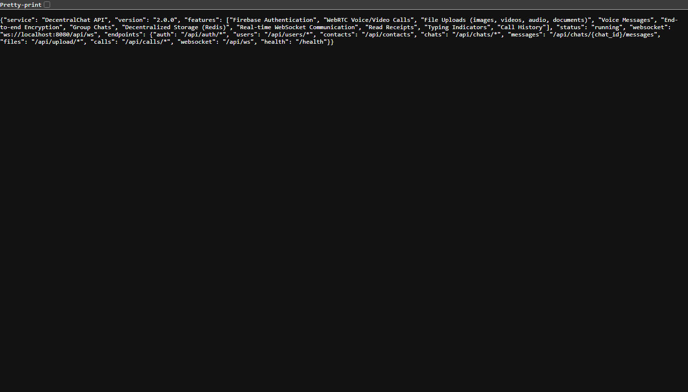

# DecentralChat 🔒

> **Secure • Decentralized • Private**

A feature-rich, end-to-end encrypted messaging platform with real-time chat, voice/video calls, file sharing, and media conversion.

---

## 📸 Screenshots

| Login | Register |
|-------|----------|
|  |  |

| Chat Interface | API Docs |
|----------------|----------|
|  |  |

---

## ✨ Features

- **🔐 End‑to‑End Encryption** — ECDH P-256 + AES-GCM 256-bit for messages and files
- **💬 Real‑Time Messaging** — Instant chat with typing indicators, read receipts, and reply/forward/edit/delete
- **📞 Voice & Video Calls** — WebRTC-powered one-on-one and group calls with STUN/TURN relay
- **📎 File Sharing & Conversion** — Upload images, videos, audio, documents; convert between 100+ formats
- **👥 Group Chats** — Create groups, manage members, administer group info
- **🔍 Search** — Full-text message search within any chat
- **🎤 Voice Messages** — Hold-to-record voice messages
- **😀 Emoji Picker** — NLP-powered search across 2000+ emojis
- **📱 Mobile‑First UI** — Fully responsive, touch-optimised design
- **☁️ Multi‑Store** — Redis cache + Firestore persistence for restart safety
- **🔗 Google Sign‑In** — One-click authentication
- **📞 Phone Verification** — OTP-based phone number verification via Twilio

---

## 🧰 Tech Stack

| Layer       | Technology                                                        |
|-------------|-------------------------------------------------------------------|
| **Backend** | Python 3, aiohttp, aiohttp-cors, aiohttp-session                 |
| **Frontend**| Vanilla JavaScript (single-page app in `frontend/index.html`)     |
| **Database**| Firebase Firestore (primary) + Redis (cache / real‑time state)    |
| **Auth**    | Firebase Auth, Google OAuth 2.0, bcrypt, JWT                      |
| **Calls**   | WebRTC (RTCPeerConnection), STUN (Google), TURN (OpenRelay)       |
| **Storage** | Local filesystem (`uploads/` directory)                           |
| **Encryption** | Web Crypto API (ECDH + AES-GCM), Fernet                        |
| **SMS**     | Twilio (optional)                                                 |
| **Media**   | Pillow, FFmpeg, PyPDF2, python-docx, LibreOffice (optional)       |

---

## 📋 Requirements

### 1. Python 3.10+

Ensure Python is installed:

```bash
python --version
```

### 2. Redis

Redis is used for caching, real‑time state, and WebSocket session data.

- **Windows**: Download from [redis.io/download](https://redis.io/download) or use [Memurai](https://www.memurai.com/)
- **Linux**: `sudo apt install redis-server`
- **macOS**: `brew install redis`

Start Redis:

```bash
redis-server
```

> ⚠️ Redis is **not strictly required**. The server falls back to an in-memory `MockRedis` if Redis is unavailable — but a real Redis instance is strongly recommended for production.

### 3. Firebase Project

1. Go to [Firebase Console](https://console.firebase.google.com/)
2. Create a new project (or use an existing one)
3. Enable **Authentication** (Email/Password + Google)
4. Enable **Cloud Firestore**
5. Generate a service account private key:
   - Project Settings → Service Accounts → Generate New Private Key
   - Save as `backend/firebase-config.json`
6. Register a **Web App** to get a Google Client ID for Google Sign-In:
   - Project Settings → General → Your apps → Add app → Web
   - Copy the **Client ID** and paste it into `frontend/index.html`:
     ```js
     const GOOGLE_CLIENT_ID = 'your-client-id.apps.googleusercontent.com';
     ```

### 4. Optional Dependencies

| Tool            | Purpose                              | Install Link                                             |
|-----------------|--------------------------------------|----------------------------------------------------------|
| **FFmpeg**      | Audio/video conversion & thumbnails  | [ffmpeg.org/download.html](https://ffmpeg.org/download.html) |
| **LibreOffice** | High-quality document conversion     | [libreoffice.org/download](https://www.libreoffice.org/download) |
| **Twilio**      | SMS-based phone verification         | [twilio.com](https://www.twilio.com)                     |

---

## 📦 Installation

### Step 1 — Clone the repository

```bash
git clone https://github.com/DraculaHub786/Decentral_Chat.git
cd Decentral_Chat
```

### Step 2 — Set up a Python virtual environment

```bash
python -m venv .venv
```

- **Windows:**
  ```bash
  .venv\Scripts\activate
  ```
- **Linux / macOS:**
  ```bash
  source .venv/bin/activate
  ```

### Step 3 — Install Python dependencies

```bash
pip install -r backend/requirements.txt
```

For enhanced file conversion support:

```bash
pip install -r backend/requirements-converter.txt
```

### Step 4 — Configure environment variables

Create `backend/.env` with the following:

```env
SECRET_KEY=your-secret-key-here
REDIS_URL=redis://localhost:6379
FIREBASE_CRED_PATH=firebase-config.json
PORT=8080

# Optional — Twilio for phone verification
TWILIO_ACCOUNT_SID=your-twilio-account-sid
TWILIO_AUTH_TOKEN=your-twilio-auth-token
TWILIO_PHONE_NUMBER=+1234567890
```

> 🔑 Generate a secure `SECRET_KEY`:
> ```bash
> python -c "from cryptography.fernet import Fernet; print(Fernet.generate_key().decode())"
> ```

### Step 5 — Place Firebase credentials

Copy your downloaded service account key to:

```
backend/firebase-config.json
```

### Step 6 — Update Google Client ID (Frontend)

Open `frontend/index.html` and locate:

```js
const GOOGLE_CLIENT_ID = '429063225880-ik4tc871593fth7vm8up51e************.apps.googleusercontent.com';
```

Replace it with your own Google Client ID from the Firebase Web App registration.

---

## 🚀 How to Run

### 1. Start Redis (optional but recommended)

```bash
redis-server
```

### 2. Run the backend server

```bash
cd backend
python server.py
```

The server starts on **`http://0.0.0.0:8080`** by default.

Expected output:

```
🚀 DecentralChat Server Started Successfully
🌐 HTTP API: http://0.0.0.0:8080
🔌 WebSocket: ws://0.0.0.0:8080/api/ws
💾 Redis: redis://localhost:6379
🔥 Firebase: ✅ Connected
📁 Upload Dir: C:/.../uploads
```

### 3. Open in browser

Visit **`http://localhost:8080`** in any modern browser.

> **Mobile**: The app is fully responsive — access it from the same network on your phone.

---

## 🌐 API Overview

| Method | Endpoint                           | Description                      |
|--------|------------------------------------|----------------------------------|
| POST   | `/api/auth/register`               | Register new user                |
| POST   | `/api/auth/login`                  | Login (username/email/phone)     |
| POST   | `/api/auth/google`                 | Google Sign-In                   |
| GET    | `/api/chats`                       | List user chats                  |
| POST   | `/api/chats`                       | Create chat (direct or group)    |
| GET    | `/api/chats/{id}/messages`         | Get messages with pagination     |
| POST   | `/api/chats/{id}/messages`         | Send message (HTTP)              |
| POST   | `/api/upload/file`                 | Upload file                      |
| POST   | `/api/upload/voice`                | Upload voice message             |
| POST   | `/api/calls/initiate`              | Initiate voice/video call        |
| POST   | `/api/files/convert`               | Convert file format              |
| GET    | `/health`                          | Health check                     |
| WS     | `/api/ws`                          | WebSocket (realtime)             |

Full endpoint list: **`http://localhost:8080/api`**

---

## 🧪 File Conversion

The server supports **100+ format conversions**:

| Category   | Source Formats                        | Target Formats                                      |
|------------|---------------------------------------|-----------------------------------------------------|
| **Image**  | jpg, png, webp, gif, bmp, tiff, ico  | jpg, png, webp, gif, bmp, tiff, ico, pdf           |
| **Audio**  | mp3, wav, ogg, aac, flac, m4a, opus  | mp3, wav, ogg, aac, flac, m4a, wma, opus           |
| **Video**  | mp4, avi, mov, webm, mkv, flv, wmv   | mp4, avi, webm, mkv, mov, gif, mp3, wav            |
| **Doc**    | pdf, docx, txt, html, md, rtf        | pdf, docx, txt, html, md, rtf, pptx, xlsx, csv     |

**Quality tiers:**
- **With LibreOffice + pdf2docx** — Full formatting, images, and layout preserved
- **Without** — Text-only fallback (embedded in code)

---

## 🏗️ Project Structure

```
Decentral_Chat/
├── backend/
│   ├── server.py                    # Main aiohttp server
│   ├── requirements.txt             # Python dependencies
│   ├── requirements-converter.txt   # Conversion-specific deps
│   ├── CONVERSION_SETUP.md          # Detailed conversion guide
│   ├── check_conversion_setup.py    # Conversion setup checker
│   ├── test_converter.py            # Converter test suite
│   ├── .env                         # Environment variables
│   ├── firebase-config.json         # Firebase credentials
│   └── test_conversions/            # Converter test artifacts
├── frontend/
│   └── index.html                   # Single-page frontend app
├── uploads/                         # File upload directory
│   ├── images/
│   ├── videos/
│   ├── audio/
│   ├── documents/
│   ├── archives/
│   ├── voices/
│   ├── avatars/
│   └── thumbnails/
├── test_conversions/                # Generated test files
├── docs/                            # Documentation screenshots
│   ├── login.png
│   ├── register.png
│   ├── chat_empty.png
│   └── api_docs.png
├── README.md
└── .gitignore
```

---

## 🛠️ Development

### Type checking

```bash
cd backend
python -m pyright server.py
```

### Test file conversion

```bash
cd backend
python test_converter.py
```

### Check conversion setup

```bash
cd backend
python check_conversion_setup.py
```

---

## ⚠️ Notes

- **Redis persistence**: For production, enable AOF + RDB in `redis.conf`:
  ```
  appendonly yes
  appendfilename 'appendonly.aof'
  save 900 1
  save 300 10
  save 60 10000
  ```
- **Uploads folder** (`uploads/`) is gitignored — data stays local.
- **File conversion** degrades gracefully: without LibreOffice, conversions fall back to text-only modes.

---

## 🙏 Thanks & Regards

Built with ❤️ by **DraculaHub786**.

- **Firebase** for authentication and Firestore database
- **Redis** for real-time caching power
- **WebRTC** for peer-to-peer communication
- **OpenRelay** for free TURN relay servers
- **The open-source community** for Pillow, PyPDF2, python-docx, and all other libraries that make this project possible

---

⭐ **Star this repo** if you found it useful!

📬 **Contributions, issues, and feature requests are welcome.**
